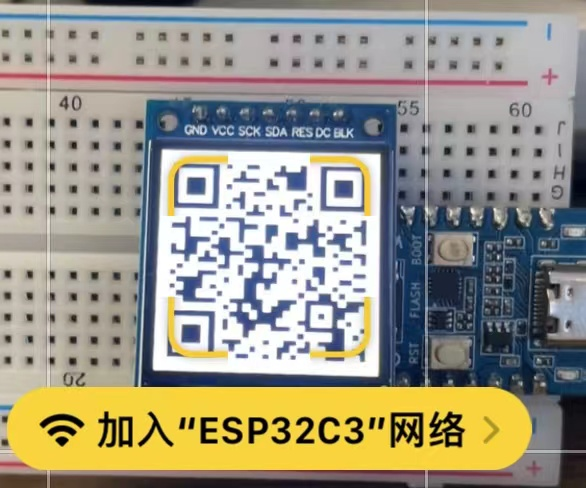
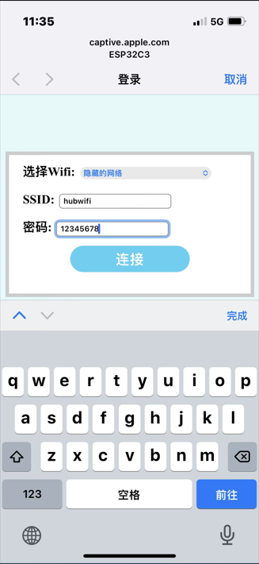
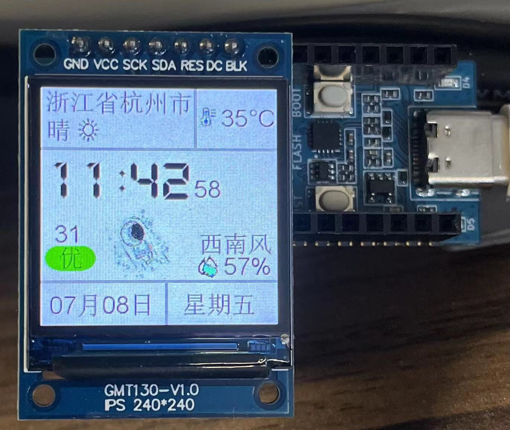
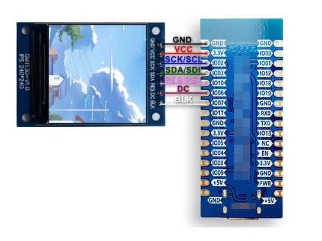

# ESP32C3Clock
基于 ESP32C3 的太空人时钟 

## 展示

二维码配置:



网络配置页:



主界面:



## 模块
1. ESP32C3_Clock 为 Arduino 开发的ESP32C3天气时钟模块 
2. server 为服务器运行的IP地址识别(纯真IP数据库), 天气获取模块

## 功能
1. WIFI 配置，存储（需要 ESP32 v2.0.4 SDK，之前的SDK存储有bug）
2. 地理位置、时间、日期、星期 显示 
3. 实时天气信息:天气、温度、湿度、风向、空气质量, 每5分钟检测一次（国家气象局更新晚半小时）

## 材料清单
1. ESP32C3 开发板（品牌随意）
2. ST7789 TFT（品牌随意，7针，若使用8针的 CS 接GND），分辨率 240*240

## 电路图 

根据自己需要接线，接线只跟TFT_eSPI库的 User_Setup.h 配置有关 



- GND 接地
- VCC 接3.3V电源
- SCL SPI时钟线,接GPIO 02
- SDA SPI数据线,接GPIO 03
- RES LCD复位,接GPIO 10
- DC  LCD数据/命令选择脚,接GPIO 06
- BLK 背光控制,接GPIO 07

## 代码编译说明

尽量使用 ESP32 2.0.4 或之后的版本(关于某些板上CDC芯片问题，自行解决)

### 依赖库(不包含ESP32自带库)

1. ArduinoJson
2. TFT_eSPI

### 配置修改

1. TFT_eSPI 库定义(备份原始 User_Setup.h，新建一个复制以下代码进入即可，默认安装位置：我的文档 -> Arduino -> libraries -> TFT_eSPI)

```C++
#define USER_SETUP_INFO "User_Setup"

#define ST7789_DRIVER 

#define TFT_RGB_ORDER TFT_BGR
#define TFT_WIDTH  240 // ST7789 240 x 240 and 240 x 320
#define TFT_HEIGHT 240 // ST7789 240 x 240

#define TFT_BACKLIGHT_ON HIGH  // 高电平开背景灯 

// #define GND 接地 
// #define VCC 3.3V电源 
#define TFT_MISO  19
#define TFT_SCLK  02    // SPI 时钟线 (SCK/SCL) 
#define TFT_MOSI  03    // SPI 数据线 (SDA/SDI) 
#define TFT_RST   10    // 重置 (RES LCD复位/低电平有效) Reset pin 
#define TFT_DC    06    // 数据/命令控制 (DC)  Data Command control pin 
#define TFT_BL    07    // 背光 (BLK, 低电平关闭背光) 

#define LOAD_GLCD  
#define LOAD_FONT2 
#define LOAD_FONT4 
#define LOAD_FONT6 
#define LOAD_FONT7 
#define LOAD_FONT8 
#define LOAD_GFXFF 

// this will save ~20kbytes of FLASH
#define SMOOTH_FONT

#define SPI_FREQUENCY  80000000

// Optional reduced SPI frequency for reading TFT
#define SPI_READ_FREQUENCY  20000000

// The XPT2046 requires a lower SPI clock rate of 2.5MHz so we define that here:
#define SPI_TOUCH_FREQUENCY  2500000
```

2. Wifi 配置使用二维码扫描连接ESP32C3的热点(热点名及密码由 user_config.h 中 AP_SSID和AP_PASSWORD 配置), 同步需要修改二维码图片 (WifiQrcode.h): 

```qrcode
WIFI:T:WPA;S:热点名;P:密码;
```
   
3. 自建天气信息服务器修改 user_config.h 的 WEATHER_URL
   
4. 可执行修改 NTP 时间同步服务器 user_config.h 的 NTP_HOST
   
5. 时区已写死(user_config.h 的 TIME_ZONE)，可在获取天气的时候由服务器分析返回 
   
6. 板载LED小灯执行配置 (user_config.h 的 LED1 和 LED2)
   